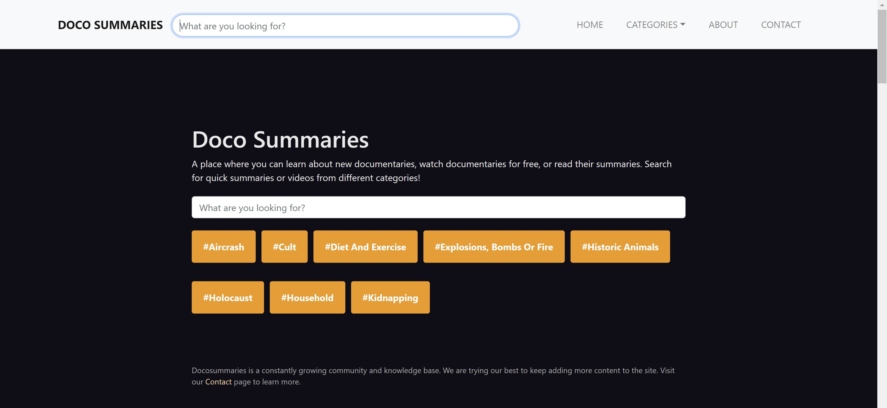

# Docusummaries

## About 

This is the codebase to [Docosummaries.com](https://docosummaries.com/).

Docosummaries is a place where you can learn about new documentaries, read plot summaries of documentaries, and find links where you could watch the documentaries for free online.

It has a search functionality where you can look up documentaries that are currently already in the database.

It is still currently in its very early stages of development.

## To Run

* Run `npm install` in the root directory to add the necessary npm packages to the project.
* Once completed, run `ng serve`.
* Navigate to `localhost:4200` in a browser.

## To Build

* Run `ng build` to build the project. The build artifacts will be stored in the dist/ directory. 
* Use `ng build --prod` for a production build.

## Contact

You can fill the form on the contact page at https://docosummaries.com/contact.

 

